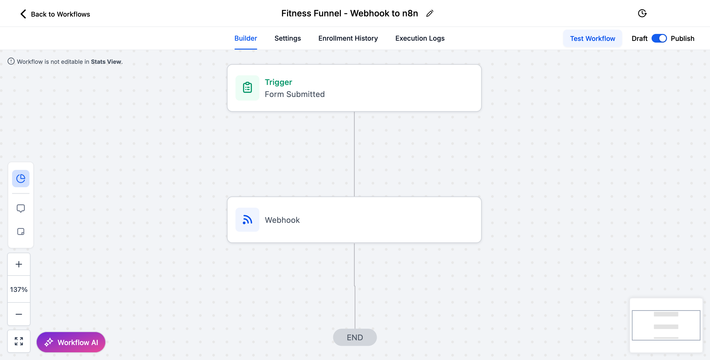

# 🧠 Automated Lead Nurturing & Conversion Funnel using GoHighLevel + n8n

This is a modular, scalable automation system designed to turn cold leads into warm clients — fully automated. Whether you're in **fitness, coaching, real estate, ecommerce, or digital services**, this funnel adapts to your niche, your style, your business.

It captures leads via a form, sends personalized emails and SMS, tracks engagement, and follows up based on behavior.  
**No-code. High-impact. Built to convert.**

---

## 🚀 What This System Does

✅ Captures leads via funnel form (GoHighLevel)  
✅ Sends instant **welcome email + SMS**  
✅ Waits smart (24h, 48h) before triggering follow-ups  
✅ Tracks email link clicks (interested vs not engaged)  
✅ Tags and qualifies leads based on behavior  
✅ Re-engages cold leads automatically  
✅ 100% modular – can be adapted to any business

---

## 🧠 Ideal For:

- Coaches (Fitness, Life, Biz, Financial)
- Service Providers (Agencies, Freelancers, SaaS)
- Local Businesses (Clinics, Salons, Law Firms)
- Real Estate, Consultants, Ecommerce & More

---

## 🛠 Tech Stack

- 🧱 [GoHighLevel](https://www.gohighlevel.com/) – for funnel, CRM & email
- ⚙️ [n8n](https://n8n.io) – for no-code backend automation
- ✉️ Gmail API – for personalized emails
- 📲 Twilio – for SMS follow-up & confirmations

---

## 🔁 Workflow Overview

1. **Lead submits form** (via GoHighLevel)
2. **Webhook triggers n8n**
3. **Lead info is parsed**
4. **Email & SMS are sent instantly**
5. **Wait 24h → Email & SMS follow-up**
6. **Wait 48h → Check engagement (clicked email?)**
7. ✅ If interested → tag lead  
8. ❌ If cold → send re-engagement email  
9. 🎯 Done. You’ve built a smarter funnel.

---

## 📸 Screenshots

### 1. 🔄 Full Workflow Overview (n8n)

### 2. 📥 Webhook Input & Lead Data Extract

### 3. 🧲 Sample Funnel Page (Customizable Design)

### 4. ⚡ GHL → Webhook → n8n Integration

---

## 📽️ Live Demo

🎥 Watch the full automation in action:  
➡️ [Click to watch the full video on Vimeo](https://vimeo.com/1072318821)

---

## 💡 Why This System?

Because you shouldn't chase leads manually.  
Because automation saves time, money and sanity.  
Because when done right, follow-up = conversion.

---

## 🧑‍💻 Built with ❤️ by [Tugui Dragoș](https://tuguidragos.com)

Want a similar system for your business or clients?  
Let’s talk → contact@tuguidragos.com
